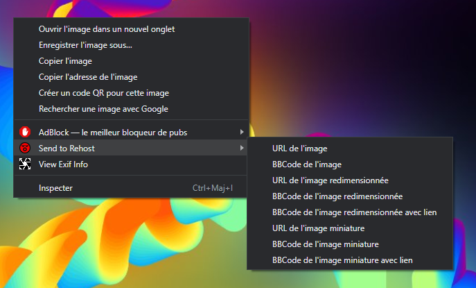

# Right click, send to rehost

Ceci est une extension qui permet de faire un click droit sur une image et l'envoyer sur Rehost.

Certains sites protègent l'accès donc ça ne fonctionne pas toujours, c'est en TODO.

## Installation

1. Télécharger le code source du plugin en cliquant sur `Code` puis `Download ZIP`, puis extraire le fichier ZIP quelque part sur votre ordinateur:

2. Aller dans la barre d'URL et tapper `chrome://extensions/`:
   
 
 
3. cliquer sur **Charger l'extension non empaquetée**

 
 
4. choisir le dossier où vous avez téléchargé le contenu au point 1.

5. L'extension doit apparaitre:

 
## Utilisation 

Une fois séléctionné l'output, il se retrouve dans votre presse papier, y'a plus qu'à coller sur HFR

xoxo
